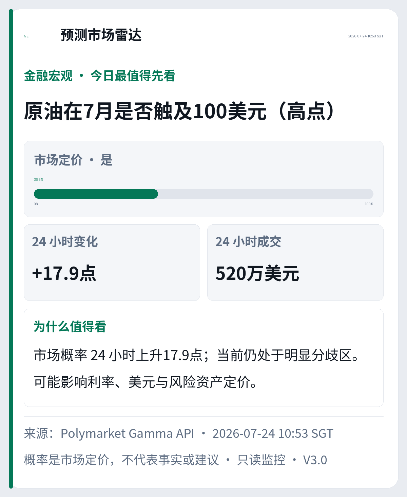

# Polymarket Sentiment Radar

> 不下注，只读市场情绪。
>
> A read-only, Chinese-first radar for understanding prediction-market sentiment.

<p align="center">
  
</p>

## 为什么做这个项目

在我看来，Polymarket 更接近一个带有赌博性质的预测市场。我不建议大家为了追逐短期结果去下注，也不把它的价格当成事实、建议或确定答案。

但它有一个非常有价值的侧面：每个概率背后都是真实参与者用资金表达的判断。把这些市场隐含概率放在一起观察，可以快速了解人们此刻对地缘政治、宏观经济、加密资产、科技商业、政治政策和体育文化事件的情绪与分歧。

对于投资者，这种情绪面可以作为研究流程中的一个参考维度。它不能替代基本面、数据核验或独立判断，但可以帮助我们更早发现市场正在关注什么、哪些预期正在快速变化，以及风险偏好正在往哪个方向移动。

即使不做投资，这个世界每天也在发生许多有意思的事情。通过预测市场看看大家正在争论什么、相信什么、担心什么，本身就是一种有趣的信息消费方式。

这就是这个脚本的目的：**把 Polymarket 从下注入口，转化为一个只读的市场情绪与世界事件雷达。**

## 它会做什么

- 从公开的 Polymarket Gamma API 读取活跃市场，不需要钱包或私钥
- 过滤已经过期、即将失效、流动性不足或语义不清楚的事件
- 将事件整理为六大板块，并优先选择三个不同板块的头版内容
- 将英文市场问题转换为更容易理解的中文事件描述
- 同时显示事件、主要选项概率、24 小时变化和成交量
- 只记录真正推送过的内容，七天内不重复推送同一故事
- 过滤低成交赛事、精确比分和发帖数量等低价值噪音
- 每天只发送一张主视觉卡片和三条摘要，避免长篇信息轰炸
- 生成可审计的 PNG、HTML 和 JSON outbox 产物

## 它不会做什么

- 不下注，不连接钱包，不持有私钥
- 不调用交易接口，不执行任何买卖动作
- 不把预测市场概率描述成事实
- 不提供投资建议或收益承诺
- 不在 dry-run 中消耗去重状态

## 信息设计

首页只回答一个问题：**今天预测市场最值得先看什么？**

主卡片展示：

1. 一个具体事件，而不是模糊的主题标签
2. 当前主要概率和 0–100% 位置
3. 24 小时概率变化与成交量
4. 这件事为什么值得关注
5. 数据来源、时间和版本

Telegram caption 再补充另外两个不同板块的事件。完整六板块报告仍写入本地 outbox，供审计使用，但不会作为第二条长消息主动推送。

视觉层基于 [TG Watch Skill](https://github.com/EricEEEEEEE/TG-watch-skill) 的 source-bound `VisualSpec → RenderSpec → Pillow` 工作流。每个可见字段都能追溯到源数据，并经过移动端字号、边界、CJK 字体和无截断检查。

## 快速开始

要求：Python 3.10+。

```bash
git clone https://github.com/EricEEEEEEE/polymarket-sentiment-radar.git
cd polymarket-sentiment-radar

python3 -m venv .venv
source .venv/bin/activate
python -m pip install -r requirements.txt
```

Linux 服务器还需要 CJK 字体：

```bash
sudo apt-get update
sudo apt-get install -y --no-install-recommends fonts-noto-cjk
```

先运行只读 dry-run：

```bash
python scripts/polymarket_news_radar.py --dry-run
```

它会读取公开市场数据、打印摘要，并在 `outbox/` 生成预览，但不会发送 Telegram，也不会写入已推送账本。

## Telegram 配置

只有正式发送才需要 Telegram 配置：

```bash
cp .env.example .env
```

填写：

```dotenv
TELEGRAM_BOT_TOKEN=your_bot_token
POLYMARKET_CHAT_ID=your_chat_or_channel_id
POLYMARKET_TOPIC_ID=your_topic_id
```

然后运行：

```bash
python scripts/polymarket_news_radar.py
```

建议先确认 dry-run 内容和图片，再用 cron、systemd 或 Supervisor 安排每日执行。调度属于部署层，本仓库不会擅自修改系统服务。

## 常用参数

```text
--dry-run   不发送 Telegram，不消耗去重状态
--force     忽略展示冷却，仅用于人工验收
--no-image  使用纯文字 fallback
--explain   输出入选与淘汰原因
--limit N   设置每次 API 查询的事件数量
```

## 数据流程

```text
Polymarket Gamma API
        ↓
有效性 / 截止时间 / 成交量过滤
        ↓
中文语义模板与六大板块归类
        ↓
故事聚类 + 7 天展示去重
        ↓
跨板块兴趣排序
        ↓
一张主卡 + 三条摘要
        ↓
Telegram + PNG/HTML/JSON outbox
```

## 项目结构

```text
scripts/
  polymarket_news_radar.py     数据获取、筛选、排序、去重与 Telegram 发送
  polymarket_radar_visual.py   source-bound 头版视觉渲染器
  tg_watch_layout.py           Pillow 声明式布局层
tests/
  fixtures/                    脱敏的市场样本
  test_polymarket_news_radar.py
assets/
  polymarket-sentiment-radar-preview.png
```

## 验证

```bash
python -m pip install -r requirements-dev.txt
python -m pytest tests -q
```

测试覆盖过期事件、截止时间、中文标题、六板块归类、故事聚类、跨板块多样性、七天去重、单消息发送、长标题、缺失变化值、极端概率和 source binding。

## 重要说明

预测市场价格反映参与者在特定时间的交易行为，可能受到流动性、参与者结构、规则设计和短期叙事影响。它适合用来观察情绪与分歧，不适合作为事实判断或单独的投资依据。

本项目与 Polymarket 无隶属或合作关系，仅使用其公开接口进行只读研究。

## English summary

Polymarket Sentiment Radar turns public prediction-market data into a concise Chinese daily briefing. It does not place bets or connect to a wallet. Instead, it treats market-implied probabilities as a sentiment signal: useful for seeing what people currently believe, fear, or debate across macro, geopolitics, crypto, technology, politics, and culture.

The system filters stale and low-quality markets, localizes event questions into Chinese, avoids repeating pushed stories for seven days, selects three different topics, and renders one mobile-first Telegram card plus a short caption. Probabilities are market prices, not facts or advice.
